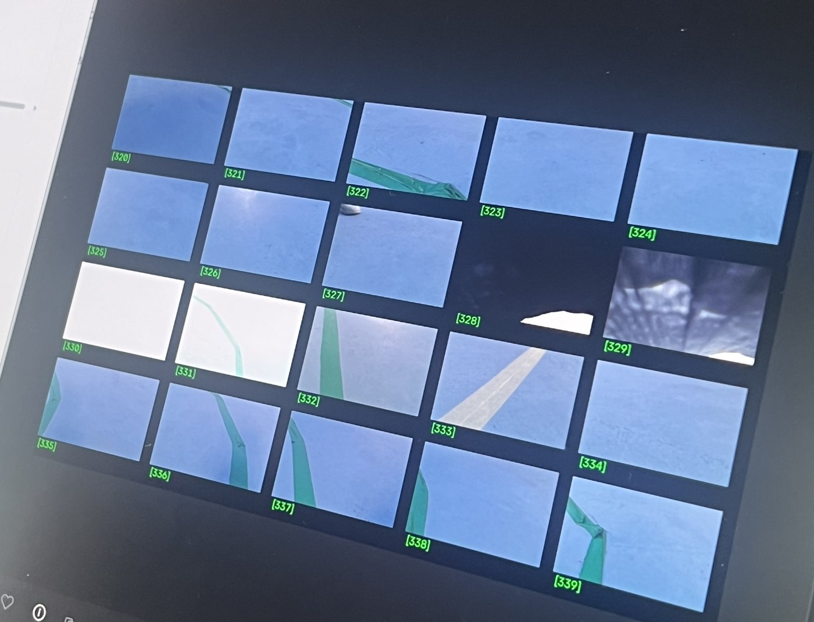
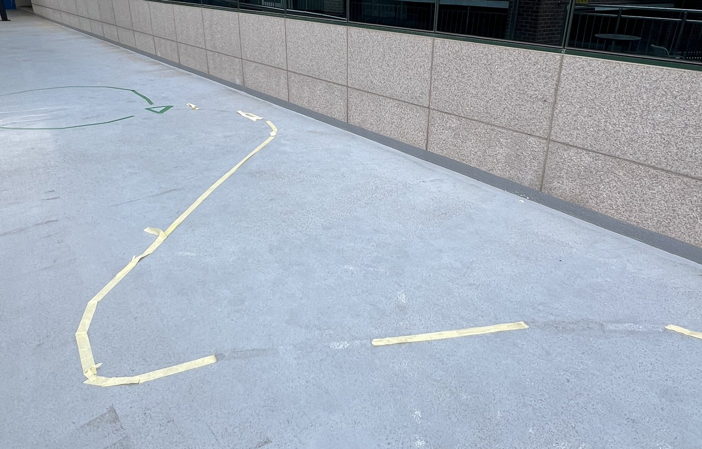
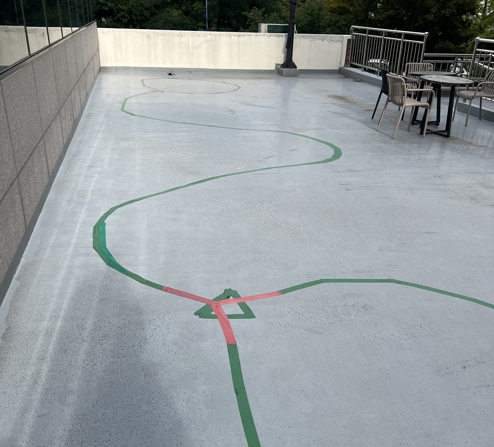
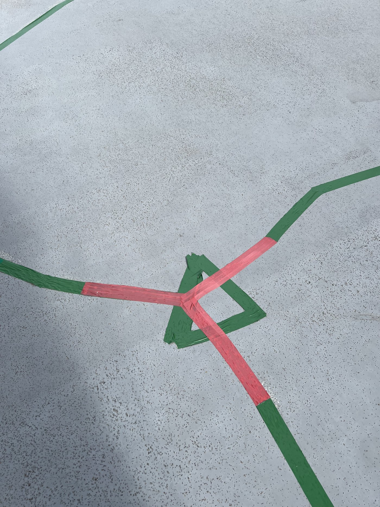
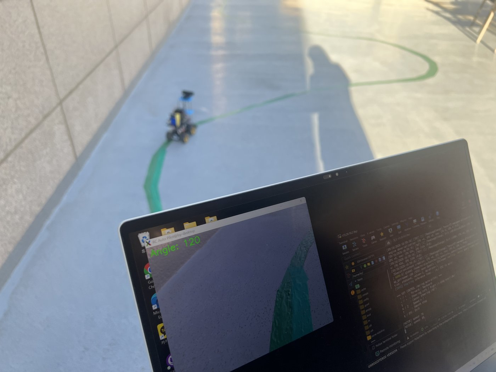
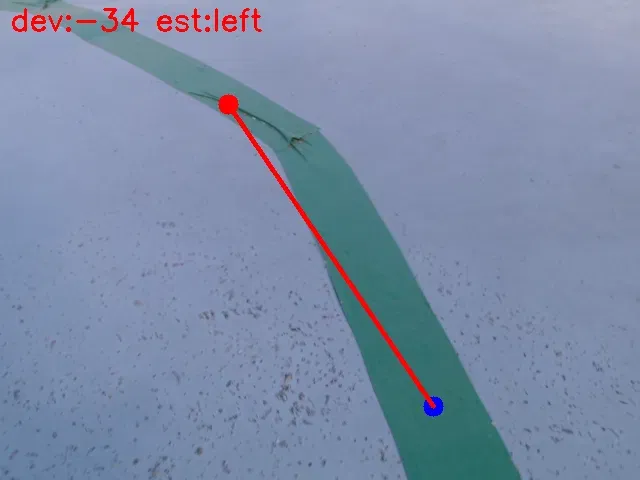

[한국어](README_kr.md) | [日本語](README.md)

# ライントレーサー (Line Tracer) — 進捗状況

屋内の教室に設置されたラインではなく、**屋外にテープで設置したライン**を辿る自律走行を目指すプロジェクト。屋外ゆえに日光・影・反射など変数が多く、比較的光が安定する**日没前後の約2時間のみ**を作業時間として撮影・走行テストを行った。

---

## 📂 Data Collector – Autonomous Driving Dataset Tool

### 📌 概要
`datacollector/` ディレクトリは、**カメラ映像＋車両の舵角/モーター制御情報**を**同時に収集し、自律走行学習用データセットを生成する**ツールを提供します。

- 車両を**キーボードで手動操作**しながら
- 毎フレームごとに **画像＋舵角＋モーター速度** が保存されます。
- PyTorch/TensorFlowの学習にそのまま使える形式のデータセット生成が目的です。

### 📁 ディレクトリ構成

```
datacollector/
├─ camera/
│   ├─ __init__.py
│   ├─ camera_capture.py    # OpenCVベースの映像キャプチャ・保存モジュール
│   └─ webcam_test.py       # カメラテスト用ユーティリティ
│
├─ hw_control/
│   ├─ __init__.py
│   ├─ drive.py             # 車両走行制御（キーボード入力処理を含む）
│   └─ input_utils.py       # Rawキー入力処理モジュール
│
├─ tools/                   # データ整理・ラベル検証ツール一式（下記「ラベル検証ツール」参照）
├─ img-collector.py         # 🚗＋📷 データ収集統合実行スクリプト
└─ readme.md
```

### ⚙️ 構成要素の説明

**1. drive.py — 車両走行制御モジュール**
- Jetson Nano + L298N + MG996Rベースの制御ロジック
- 機能
  - 前進／後進の制御
  - 舵角（サーボ）の制御
  - 速度調整
  - 逆方向入力時の安全停止
- 外部に提供する主なAPI
  - `run_drive_control(stop_flag)`
  - `get_current_state()` → `(servo_angle, motor_speed)` を返す

**2. camera_capture.py — 映像キャプチャモジュール**
- OpenCVでWebカメラのフレームを読み取り保存
- 機能
  - 一定周期（`save_interval`）ごとに画像を保存
  - ラベルの自動記録（CSV）
  - ファイル名に舵角/速度を含める → 学習ラベリングの自動化

**3. img-collector.py — 統合実行スクリプト**
- 🚗走行スレッド＋📷カメラスレッドを同時に実行
- 機能
  - stop_flag共有によるクリーンな終了
  - 走行状態と画像が時間的に同期
- 実行例

```bash
sudo python3 img-collector.py
```

### 🔌 H/W配線ガイド

**▶️ L298N DCモーター配線**

| Jetson Nano Pin (BOARD) | L298N Pin | 機能 |
|---|---|---|
| 33 | ENA / PWM | DCモーター速度制御 |
| 31 | IN1 | 方向制御1 |
| 29 | IN2 | 方向制御2 |
| GND | GND | 共通接地 |

⚠️ **注意**
- Jetsonの5VとL298Nの5V OUTを**絶対に接続しないこと**（電圧衝突のリスク）
- DCモーターの電源には外部12Vまたは7.4Vバッテリーの使用を推奨

**▶️ MG996Rサーボ配線**

| サーボ配線 | 接続先 |
|---|---|
| 茶（GND） | Jetson GND |
| 赤（VCC） | Jetson 5V |
| 黄（PWM） | Jetson BOARDピン32 |

### 🧩 全体動作フロー

```
img-collector.py
   ├─ Thread 1 → drive.run_drive_control()
   │               • キーボード入力処理
   │               • DC/サーボ値の更新
   │
   └─ Thread 2 → camera_capture_loop()
                   • フレームキャプチャ
                   • 画像保存
                   • state_getter()でラベル取得
```

→ 結果として、**画像と舵角/速度が同期したデータセット**が生成されます。

### 📦 データセット構成

```
dataset/
├─ 20240210_153015123456_angle120_speed50.png
├─ 20240210_153015225678_angle90_speed40.png
└─ data_labels.csv
```

**CSV例**

| timestamp | image_path | servo_angle | dc_motor_speed |
|---|---|---|---|
| 20240210_153015123456 | 20240210_153015123456_angle120_speed50.png | 120 | 50 |
| 20240210_153015225678 | 20240210_153015225678_angle90_speed40.png | 90 | 40 |

### ▶️ 実行方法

**1️⃣ カメラテスト**
```bash
python3 camera/webcam_test.py
```

**2️⃣ 車両操作テスト**
```bash
sudo python3 hw_control/drive.py
```

**3️⃣ データ収集の全体実行**
```bash
sudo python3 img-collector.py
```

---

## 進捗状況

### 7/10
プロジェクト開始、ロボットの組み立ておよび走行準備。特に重要だったのはバッテリーの準備でした。

### 7/23
コード作成のための計画に沿ってコード設計を実施、車両の走行テストおよび画像データ収集を進行。

### 7/25〜8/6
休暇

### 8/7
データ収集を実施！

### 8/12
角度ごとのデータ不足を補うため、大規模な追加撮影を実施。撮影後に確認すると、天井や手すりが写り込んだ写真や、車線を見失った状態の写真が多数混在していることが判明。データの「量」だけでなく「質」の確認が必要だと気づく。



*目視確認用グリッドの一部。白飛び・暗転・足の写り込み・車線が写っていないフレームなどが混在している。*

### 8/13
初めてのモデル再学習を実施。しかし学習を重ねるうちに、同じデータ・同じコードでも実行のたびに精度が大きく変動する現象（正常に収束する場合と、特定のクラスしか予測しなくなる「崩壊」状態に陥る場合）を確認。原因を探るなかで、①クラス間のデータ数の偏り（最大8倍以上）、②乱数シード未固定、③勾配爆発への対策不足、の3点が重なっていたことが判明。乱数シード固定・クラス重みの上限設定・勾配クリッピング・ベストエポックの保存という4つの対策をコードに追加し、学習の安定性を確保した。

### 8/13〜8/14
屋外に設置していた黄色い直線テープの一部が破損し交換が必要になったが、予備のテープがなく、代わりに緑色のテープを使用することにした。モデルのラベルは色ではなく舵角（servo_angle）のみを基準としているため、テープの色変更が学習に直接影響を与えることはないと判断し、交換を実施した。



*屋外コース。黄色いテープで設置した区間（左上には緑のテープも見える）。*

### 8/14〜8/19
「テスト精度（test_acc）が高いモデルほど実走行が良いとは限らない」という逆説的な現象を確認。特にtest_acc 49.83%のモデルが、それ以前のモデルよりも実走行で大きく車線を外れるという結果に。原因を調べるため、以下を実施：

- 撮影データに**左右反転・輝度調整・回転・平行移動**を用いたリサンプリング（resampling、オーバーサンプリング）を導入
- 同一シーンを大量の連続フレームで撮影していた「重複データ」をクラスタ単位で整理する仕組みを構築
- テープの色（緑・黄）を画像処理で検出し、写真に写る実際の車線の傾きを幾何学的に計算して、ラベル（舵角）と実際の画像内容が一致しているかを検証する独自ツール（`label_check_v3.py` ほか）を開発
- 検証の結果、走行中に車線を外れた際の手動修正操作などが原因と見られる**ラベル誤り**が一定数存在することを確認。信頼度の高い誤りパターンのみを自動的に再ラベリングするパイプラインを構築し、3つの異なる撮影バッチに適用した結果、いずれも誤りラベルが約80%減少することを確認

→ ツールの詳細は下記「ラベル検証ツール」を参照。



*コース全体の様子（緑テープ）。中央付近に分岐・合流部分がある。*



*分岐・合流部分の拡大。*

### 8/21〜9/2
ラベル修正済みデータやリサンプリング済みデータを用いて複数回の再学習・実走行テストを反復。オフラインでのオーバーサンプリング（リサンプリング、4倍増量）を行ったバッチでは test_acc 61.76% を記録するなど改善が見られた一方、依然としてクラス不均衡やラベル品質のばらつきが完全には解消されておらず、実走行の安定性にはまだ課題が残ることを確認。コース自体の一部補修も行い、補修後のコースで新たにデータを再収集し、既存データと統合したうえで再学習・実走行テストを継続中。



*実走行テストの様子。ノートPCの画面にカメラ映像と推定舵角（Angle: 120）が表示されている。*

---

## ラベル検証ツール（label_check_v3.py）

`datacollector/tools/label_check_v3.py` は、写真に写る実際の車線の傾きを計算し、ファイルに保存されたラベル（舵角）と方向が一致しているかを検証するツールです。

**動作原理**
1. 緑・黄のテープをHSV色範囲で検出します。
2. 画面の上部と下部で検出された画素の平均位置をそれぞれ求め、2点を結んで傾き（偏差）を計算します。
3. 計算した方向（左／直進／右）がラベルの方向（30・60／90／120・150）と異なる場合、MISMATCHとして記録します。
4. 同じシーンが連続して複数枚保存されている場合は1つの事象（cluster）にまとめ、実際に確認すべき件数を減らします。
5. 緑と黄のテープが同時に写る交差・合流シーンは計算が不安定なため、mixed_sceneとして分離し、信頼度の低い参考情報として別管理します。



*図．計算原理の可視化。赤い点（上部の平均）と青い点（下部の平均）を結んで傾きを求めます。この写真はラベルが90（直進）でしたが、実際は左カーブの区間だった誤りの例です。*

**後続処理**
- `filter_high_confidence.py`：目視確認で信頼度が高かった条件（90なのに偏差が±30以上など）のみを抽出します。
- `relabel_high_confidence.py`：抽出した事象の各フレームのファイル名を、計算された角度に合わせて一括修正します。実行前に元データを自動でバックアップします。

**結果**
- 目視で確認した疑わしい事例11件のうち10件が実際のラベル誤りで、1件は交差シーンでツールが誤判定したものでした。
- 異なる3つの撮影バッチに適用した結果、単一シーンのMISMATCH事象が550→115件、443→90件、673→99件に減少しました（約80%減）。

**限界**
交差・合流シーンではツールが不正確になり得るため、自動修正の対象から除外しました。また、検証と再検証に同じツールを使っているため、減少率は独立した精度指標ではなく、ツール基準での改善度として捉える必要があります。

---

## 現在のステータス

学習パイプライン（データ収集 → 品質フィルタリング → ラベル検証・修正 → 学習 → TensorRTへの変換 → 実走行テスト）は一通り構築済み。今後は実走行での安定性向上（車線を見失った際の挙動改善、クラス不均衡のさらなる是正）を中心に継続して取り組む予定。

## 今後の計画

現在は舵角を30/60/90/120/150度のいずれかに割り当てる**分類（classification）**方式で学習しているが、この場合モデルが5段階の角度のうちどれか一つを選んで予測するため、実走行時に操舵が階段状にカクカクと切り替わる傾向があった。今後は**回帰（regression、線形回帰）**方式に学習方法を切り替え、モデルが「87度」「112度」のような連続的な角度値を直接予測できるようにする計画である。これにより、操舵の切り替えがより自然でスムーズな走行を実現することを目指す。
